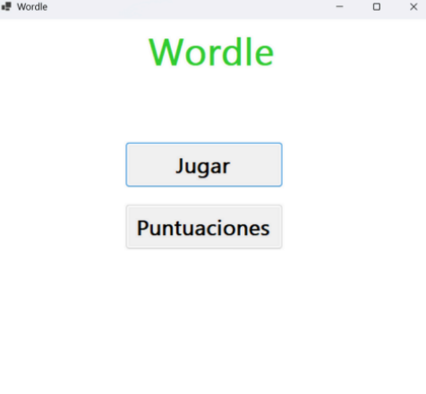
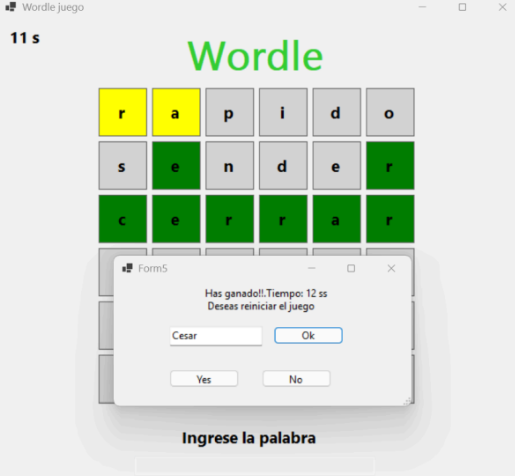

# Wordle

This project implements the game Wordle using a hybrid architecture that combines high-level programming (C#) with low-level logic (Assembly embedded in C).

## Preview

## Features
- Three difficulty levels with different word lengths.
- Graphical user interface built with C# Windows Forms.
- Core game logic implemented in C with inline x86 Assembly.
- Native DLL integration between the C# application and the game logic.
- Scoreboard that stores and displays player scores.

## Architecture
### Frontend (C#)
- Handles the graphical interface and user interaction
- Receives player input and displays game results
- Calls functions exposed by the native library

### Backend (C + Inline x86 Assembly)
- Implements the game logic
- Validates guesses
- Compares words and determines letter matches
- Manages game rules and score calculations
