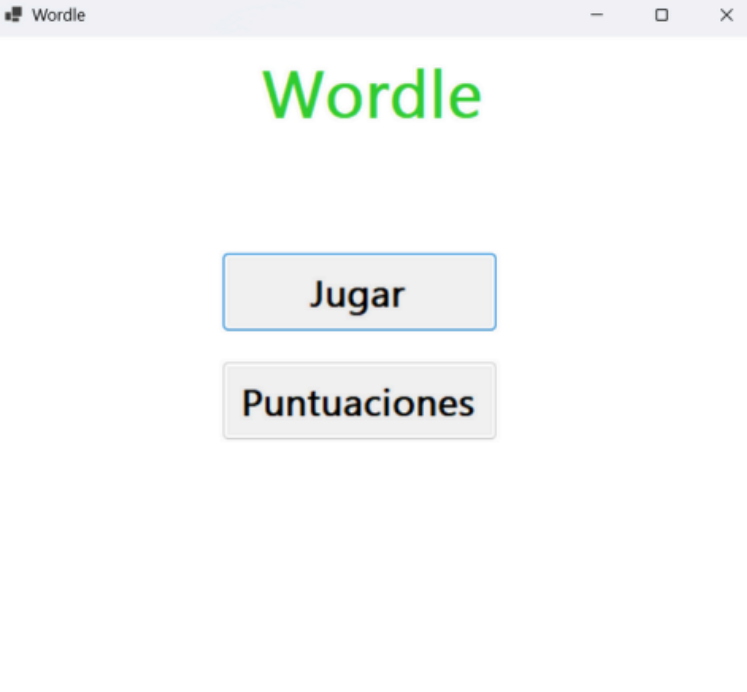

# Wordle

This project implements the game Wordle using a hybrid architecture that combines high-level programming (C#) with low-level logic (Assembly embedded in C).

## Preview

The goal is to demonstrate interoperability between managed and unmanaged code by delegating the core game logic to a native DLL written in C with inline Assembly, while the user interface and interaction are handled in C#.
